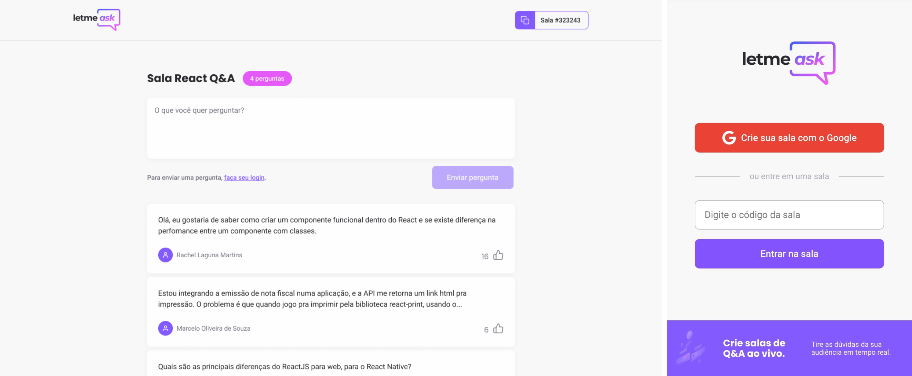

# Let Me Ask 💭

Este é o repositório do **Let Me Ask**, projeto da sexta edição do Next Level Week da Rocketseat.

É uma aplicação onde você pode fazer perguntas sobre diversos temas. O usuário é livre para criar salas de temas específicos e destacar as perguntas mais interessantes.

Você pode acessar o **Let Me Ask** <a href="https://letmeask.mitestainer.com/" target="_blank">aqui</a>.

## Detalhes

O **Let Me Ask** é uma aplicação React serverless. O projeto foi feito com Create React App e utiliza o Firebase como servidor de autenticação, banco de dados e hospedagem.

## A milha extra

Aplicações sempre estão em constante desenvolvimento, portanto poderei desenvolver esse projeto indefinidamente! A graça está em adicionar novas funcionalidades, fazer correções, e ver o produto do seu esforço.

Sendo assim, fiz as seguintes alterações no projeto:

- ✔️ Redirecionamento para domínio prórpio ([https://letmeask.mitestainer.com/](https://letmeask.mitestainer.com/)) ➡️
- ✔️ Adição de favicon 💁
- ✔️ Utilização do Github Actions para o deploy (CI/CD) ⚙️
- ✔️ Upgrade para Styled Components 💅
- ✔️ Responsividade, com ajuste de layout e menu hamburguer 📱
- ✔️ Inclusão de Toasts no lugar dos alerts do browser 🍞
- ✔️ Ajuste de metatags e adição de thumbnail para social sharing 🔗
- ✔️ Desenvolvimento do prompt de exclusão da sala ⚠️
- ⏳ Tema escuro 🌙
- ✔️ Inclusão de linter 🔎

E muito mais possibilidades! 🚀

## Para contribuir

Se você quiser editar o Let Me Ask, faça um clone do projeto. Em seguida, instale as dependências através do comando `npm i`. Para visualizar o projeto no localhost, execute `npm start` e acesse `localhost:3000`.
